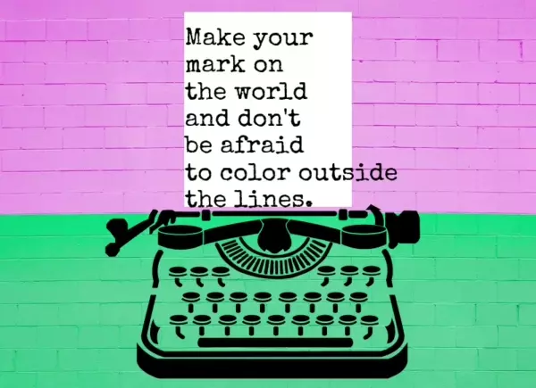

## Latest articles 🗞️

You can subscribe to my [RSS Feed](https://www.roboleary.net/feed.xml).

<!-- BLOG:START -->
 - 26 Jan 24 » [Make your web feed easy to find, autodiscoverable even](https://www.roboleary.net/2024/01/26/easy-discover-feed.html)
 - 24 Jan 24 » [Eleventy - Create a global production flag](https://www.roboleary.net/webdev/2024/01/24/eleventy-production-flag.html)
 - 21 Jan 24 » [Don&#39;t sleep on native lazy loading iframes - now available in a browser near you](https://www.roboleary.net/frontend/2024/01/21/lazy-load-iframes.html)
 - 17 Jan 24 » [Hey, hey we&#39;re the translate, scale, and rotate CSS properties - and we don&#39;t monkey around](https://www.roboleary.net/css/2024/01/17/translate-rotate-scale-properties.html)
 - 31 Dec 23 » [VS Code - Fix a task automation issue &#39;The terminal process failed to launch &lpar;exit code: 127&rpar;&#39;](https://www.roboleary.net/vscode/2023/12/31/automated-task-fix-vscode.html)<!-- BLOG:END -->

## Support my work

Did I make something that helped you?

You can consider [supporting my work](https://ko-fi.com/roboleary). You can buy me a coffee, or make a regular donation. 🌈🪙

Thanks! 🙏
